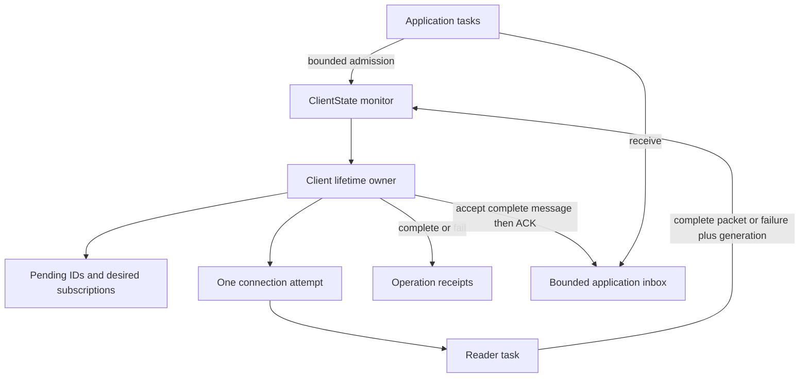

# Ownership and failure boundaries

The client owner alone opens connections, decides retries, allocates protocol IDs,
records pending operations, and processes acknowledgements. The reader reports
complete packets or errors tagged with its connection generation. It never retries
or invokes application code. Old-generation events cannot affect a new attempt.
The writer has an I/O deadline. Keepalive is a timestamp state object, driven by the
owner's event-loop deadline, with no separate pinger task.

`ClientState_` serializes bounded admission and notification. It does not perform
I/O. Each accepted operation remains charged until completion, across reconnects.
Payload copying happens after admission capacity is obtained. Pending QoS 1 state
and its packet ID exist before the first write, so ACK timing cannot lose a receipt.
The outgoing operation limit also reserves metadata for subscriptions and QoS 0.
Restored subscriptions are separately bounded by the subscription limit.

A connection failure is an event; an operation failure is a result. Retriable
connection failures preserve accepted QoS 1 work. Invalid arguments fail the
caller, rejected subscriptions fail their receipt, and terminal lifecycle failure
completes every remaining receipt with the stored cause. A receipt wait timeout
does not imply non-delivery or cancel the operation. QoS 0 writes fail with uncertain
delivery when the transport breaks; they are not replayed.

The public `Receipt` interface is read-only. Its writable `Completion_` monitor
uses a public monitor method so updates wake existing waiters; private helper
methods do not provide that notification boundary in Toit. Late observers and
multiple observers see the same persistent result.

All blocking state predicates include terminal or closing state. Normal close
requests DISCONNECT when online; force-close cancels the attempt. Attempt cleanup
runs in a critical section, cancels the reader, closes its own link, and completes
lifetime observers. No user callback runs in cleanup. Incoming accepted messages
remain drainable after shutdown, within their configured budget.

The broker has a different natural owner: `BrokerState_` owns all routing metadata
and payload references. Its monitor serializes admission and storage, but never
reads or writes sockets. Each connection has a reader and writer. A generation
prevents a replaced connection from changing its successor's session. References
are registered before network writes; PUBACK releases ownership. A reconnect
replays the same IDs with DUP. The first packet on a connection is always CONNACK.

Storage must not reenter the broker. Filesystem latency can delay state operations;
choose an adapter with bounded/cancelable I/O for the target. Broker state is not a
power-loss journal. See [storage](storage.md) for the memory envelope and failure
policy at each resource limit.
